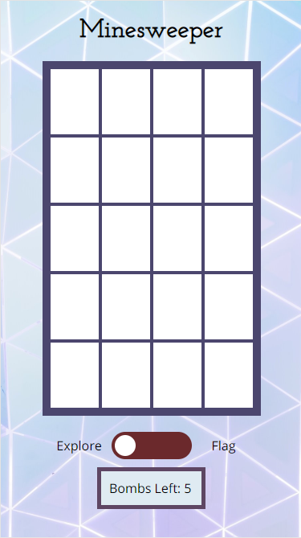

# Minesweeper

https://cygnet717.github.io/Minesweeper/

## Summary

I enjoy playing logic games like Minesweeper and I decided to make some from scratch just for the experience of building the code to make the game work. The part that took the most thought was how to build the clues after I had randomly placed the bombs on the gameboard array.

One problem with the game is that if you look at the code you can get the answer.
 
## ScreenShot

## Technology Used

HTML, CSS, jQuery